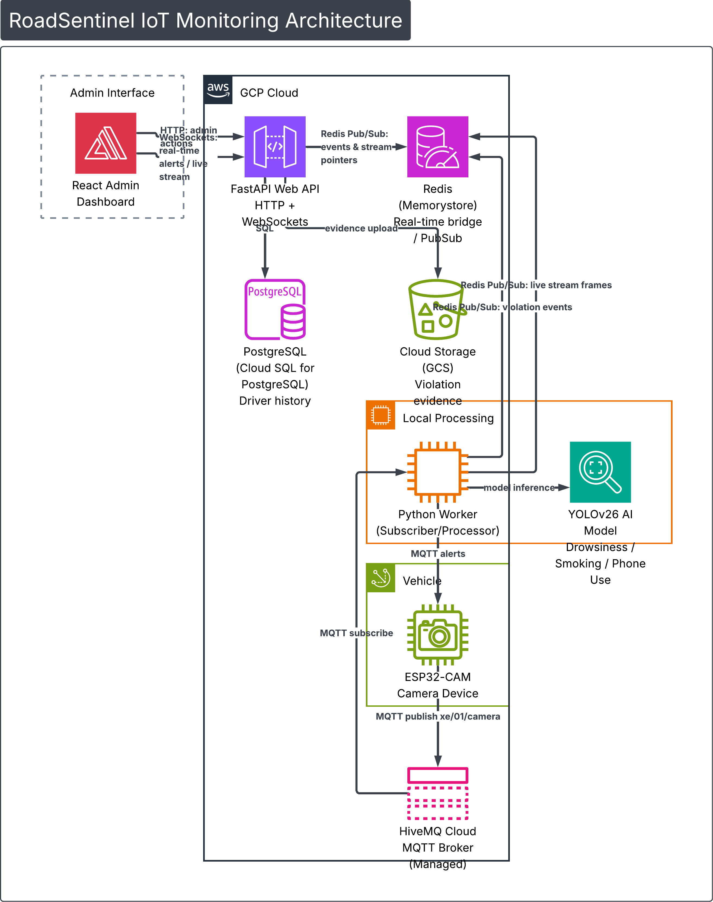

  
   
  
    

# RoadSentinel: Enterprise-Grade Driver Behavior & Fleet Monitoring Solution

**RoadSentinel** is a next-generation, real-time monitoring ecosystem that integrates **IoT** (ESP32-CAM) and **AI (YOLOv26)** via the **MQTT** protocol to effectively mitigate road accident risks caused by human error. The system provides a comprehensive fleet management solution, enabling transport enterprises to digitize driver behavior, track operational hours, and optimize fleet safety standards.

> Developed by **RoadSentinel Team** for
>
> <h4 align="center">
>   <a href="#" target="_blank">
>     Project-Based Learning 5 (PBL5) – DUT
>   </a>
> </h4>

---

## System Architecture
The RoadSentinel ecosystem consists of three core components:

  
   
  <em>Overview of the RoadSentinel system architecture</em>

## Key Features
- **Risk Mitigation**: Proactively detect and alert for drowsiness, distractions, and smoking to prevent accidents.

- **Operational Digitization**: Transform driver behaviors and work sessions into actionable data for enterprise management.

- **Fleet Optimization**: Provide a centralized dashboard for real-time monitoring and historical violation analytics.