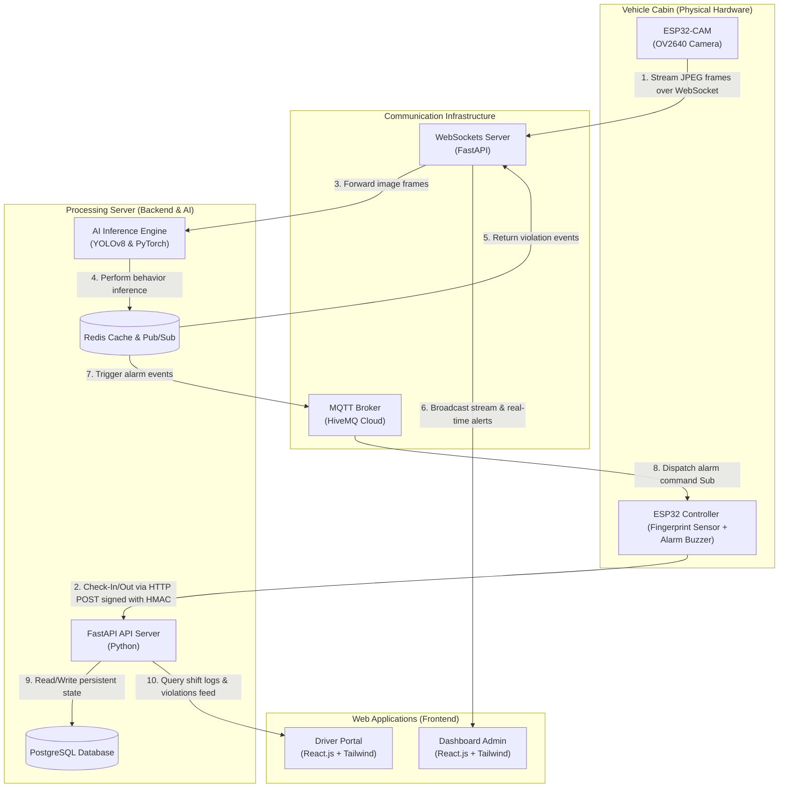

<p align="center" style="display: flex; justify-content: center; align-items: center; flex-wrap: wrap; gap: 15px;">


  
  
  
    
</p>

# RoadSentinel: Enterprise-Grade Driver Behavior & Fleet Monitoring

**RoadSentinel** is an enterprise-grade, real-time driver behavior and fleet monitoring ecosystem. It integrates **IoT** devices (ESP32) and **Artificial Intelligence (YOLOv8)** over **MQTT** to detect risky driver behaviors (drowsiness, phone usage, and distraction) and secure driving shifts.

This document provides instructions on how to install and run the system **purely in software** (using your computer's webcam and a simulator script to mock the physical ESP32 hardware for development and evaluation).

---

## System Architecture

The following diagram illustrates the production runtime architecture of the system when deployed with physical embedded hardware on vehicles (excluding the development Simulator):


```mermaid
graph TD
    subgraph Cabin["Vehicle Cabin (Physical Hardware)"]
        CAM["ESP32-CAM <br> (OV2640 Camera)"]
        MCU["ESP32 Controller <br> (Fingerprint Sensor + Alarm Buzzer)"]
    end

    subgraph Messaging["Communication Infrastructure"]
        WS["WebSockets Server <br> (FastAPI)"]
        MQTT["MQTT Broker <br> (HiveMQ Cloud)"]
    end

    subgraph Server["Processing Server (Backend & AI)"]
        BE["FastAPI API Server <br> (Python)"]
        AI["AI Inference Engine <br> (YOLOv8 & PyTorch)"]
        DB[("PostgreSQL Database")]
        Redis[("Redis Cache & Pub/Sub")]
    end

    subgraph Client["Web Applications (Frontend)"]
        Admin["Dashboard Admin <br> (React.js + Tailwind)"]
        Driver["Driver Portal <br> (React.js + Tailwind)"]
    end

    %% Data Flow Routing
    CAM -->|1. Stream JPEG frames over WebSocket| WS
    MCU -->|2. Check-In/Out via HTTP POST signed with HMAC| BE
    
    WS -->|3. Forward image frames| AI
    AI -->|4. Perform behavior inference| Redis
    Redis -->|5. Return violation events| WS
    WS -->|6. Broadcast stream & real-time alerts| Admin
    
    Redis -->|7. Trigger alarm events| MQTT
    MQTT -->|8. Dispatch alarm command Sub| MCU
    
    BE -->|9. Read/Write persistent state| DB
    BE -->|10. Query shift logs & violations feed| Driver
```

---

## Project Directory Structure

```text
├── Backend/            # API Service (Python / FastAPI) & YOLOv8 Inference Engine
├── Frontend/           # React.js Web Portals (Admin & Driver Portals)
├── Simulator/          # ESP32-CAM + Fingerprint + Buzzer Mock Simulator (for development)
│   ├── esp32_simulator.py  # Main simulation executable script
│   └── model/best.pt       # Pre-trained YOLOv8 weights
├── Arduino-CAM/        # PlatformIO source code for physical ESP32-CAM
└── Arduino-Device/     # PlatformIO source code for physical ESP32 Fingerprint/Buzzer NodeMCU
```

---

## Prerequisites

1. **Python 3.13+** (Required for Backend & Simulator)
2. **Node.js v18+ & npm** (Required for Frontend)
3. **PostgreSQL** (Relational Database for Backend)
4. **MQTT Broker** (e.g. Eclipse Mosquitto or a cloud instance like HiveMQ)

---

## Installation & Software-Only Execution Guide

### Step 1: Start MQTT Broker (Mosquitto)

If you are on macOS (using Homebrew):
```bash
brew install mosquitto
brew services start mosquitto
```
On Windows/Linux, download and install the Mosquitto service from the official website. Ensure the broker runs and listens on `localhost:1883`.

---

### Step 2: Setup & Run the Backend

1. **Navigate to the Backend directory**:
   ```bash
   cd Backend
   ```

2. **Create and activate a virtual environment (Virtualenv)**:
   ```bash
   python -m venv .venv
   source .venv/bin/activate  # On Windows: .venv\Scripts\activate
   ```

3. **Install the dependencies**:
   ```bash
   pip install -r requirements.txt
   ```
   *(Note: requirements.txt resolves platform-native PyTorch & OpenCV packages automatically based on your operating system)*

4. **Configure environment variables**:
   Copy the template env file and fill in your PostgreSQL connection string & MQTT credentials:
   ```bash
   cp .env.example .env
   ```

5. **Run Database Migrations (Alembic)**:
   ```bash
   alembic upgrade head
   ```

6. **Start the FastAPI Backend server**:
   ```bash
   python -m uvicorn main:app --reload --host 0.0.0.0 --port 8000
   ```
   The backend will start running on `http://localhost:8000`.

---

### Step 3: Setup & Run the Frontend

1. **Navigate to the Frontend directory**:
   ```bash
   cd Frontend
   ```

2. **Install npm packages**:
   ```bash
   npm install
   ```

3. **Configure environment variables**:
   Create a `.env` file based on `.env.example`:
   ```bash
   cp .env.example .env
   ```

4. **Launch the Frontend Web Portal in dev mode**:
   ```bash
   npm run dev
   ```
   The web applications will open on `http://localhost:3000`.

---

### Step 4: Run the ESP32 Simulator (Webcam + Fingerprint + Buzzer)

The `Simulator/` directory contains `esp32_simulator.py` to mock the hardware inputs and outputs.

1. **Navigate to the Simulator directory**:
   ```bash
   cd Simulator
   ```

2. **Execute the simulator script**:
   ```bash
   python esp32_simulator.py
   ```
   *By default, the script opens your computer's built-in webcam, connects to the backend WebSocket (ws://localhost:8000/api/v1/ws/camera), and registers as a subscriber to the local MQTT broker (localhost:1883).*

---

## System Integration & Testing Workflow (Software-Only)

Once the Backend, Frontend, and Simulator are running in parallel, follow this sequence to test the system integration:

### 1. Create a Driver on the Dashboard
- Log in to the Admin Dashboard (`http://localhost:3000`).
- Navigate to the **Drivers** screen and create a new driver user (or use an existing driver record).

### 2. Simulate Fingerprint Scan to start session (Check-In)
- On the simulator CLI console, type `f` and press **Enter**.
- The script will fetch and print the active list of drivers from the Backend.
- Select the index number of the target driver to clock-in.
- The simulator computes the HMAC-SHA256 signature and submits a POST request to the Backend. The Backend logs an **ACTIVE** driving session.
- The web portal status cards will instantly update to green (**ACTIVE**).

### 3. Simulate Biometric Enrollment (Enroll)
- On the Admin Portal drivers list, click **Enroll Fingerprint** for a driver.
- The system publishes an enrollment command over the MQTT topic `roadsentinel/commands/enroll`.
- The simulator captures the command and displays step-by-step guidance on your CLI console:
  1. Place finger first time (Press Enter on the CLI).
  2. Lift finger.
  3. Place finger second time (Press Enter on the CLI again).
- The simulator saves the biometric template (e.g., `FINGER_23`), makes a PATCH API call to bind it to the driver, and signals success back to the Admin screen.

### 4. AI Behavior Inference & Alarm Buzzer Simulation
- The simulator reads frames from your webcam and sends them to the Backend.
- Simulate a violation in front of the webcam (e.g., close your eyes for more than 2.5 seconds to simulate **sleepiness**, or hold a phone to your ear).
- The Backend processes the frame, runs YOLOv8 and the Sliding Window filter, and flags a violation:
  1. A red alert toast flashes instantly on the React web portals.
  2. The server publishes a buzzer warning command to the vehicle's MQTT topic `roadsentinel/alerts/{alert_type}`.
- The simulator hears the alarm command and prints `🚨 [BUZZER ALARM] BUZZER ON!!! 🚨` while triggering system bell sounds.
- Once the violation stops, the Backend publishes a recovery message, turning off the buzzer alarm (`🔕 BUZZER OFF`) on the vehicle.