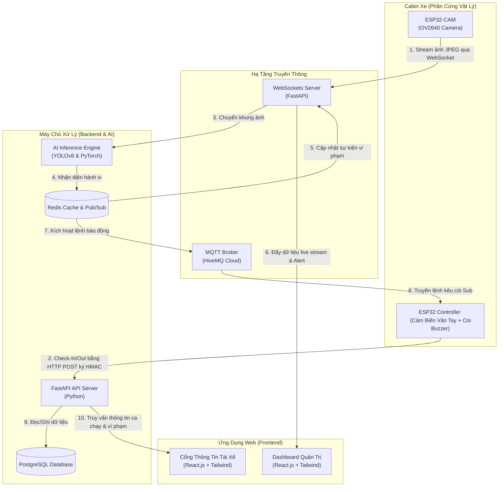

<p align="center" style="display: flex; justify-content: center; align-items: center; flex-wrap: wrap; gap: 15px;">


  
  
  
    
</p>

# RoadSentinel: Enterprise-Grade Driver Behavior & Fleet Monitoring

**RoadSentinel** là hệ sinh thái giám sát thời gian thực tích hợp thiết bị **IoT** (ESP32) và **Trí tuệ nhân tạo (YOLOv8)** qua giao thức **MQTT** để phát hiện hành vi nguy hiểm của tài xế (buồn ngủ, sử dụng điện thoại, mất tập trung). 

Tài liệu này hướng dẫn cách cài đặt và vận hành hệ thống **chỉ bằng phần mềm** (sử dụng Webcam máy tính và Script giả lập thay thế cho phần cứng ESP32 thật).

---

## Kiến Trúc Hệ Thống (System Architecture)

Dưới đây là sơ đồ kiến trúc vận hành thực tế (Production Architecture) của hệ thống khi triển khai với phần cứng nhúng vật lý trên xe (đã lược bỏ bộ giả lập Simulator phục vụ phát triển):


```mermaid
graph TD
    subgraph Cabin["Cabin Xe (Phần Cứng Vật Lý)"]
        CAM["ESP32-CAM <br> (OV2640 Camera)"]
        MCU["ESP32 Controller <br> (Cảm Biến Vân Tay + Còi Buzzer)"]
    end

    subgraph Messaging["Hạ Tầng Truyền Thông"]
        WS["WebSockets Server <br> (FastAPI)"]
        MQTT["MQTT Broker <br> (HiveMQ Cloud)"]
    end

    subgraph Server["Máy Chủ Xử Lý (Backend & AI)"]
        BE["FastAPI API Server <br> (Python)"]
        AI["AI Inference Engine <br> (YOLOv8 & PyTorch)"]
        DB[("PostgreSQL Database")]
        Redis[("Redis Cache & Pub/Sub")]
    end

    subgraph Client["Ứng Dụng Web (Frontend)"]
        Admin["Dashboard Quản Trị <br> (React.js + Tailwind)"]
        Driver["Cổng Thông Tin Tài Xế <br> (React.js + Tailwind)"]
    end

    %% Luồng truyền dữ liệu
    CAM -->|1. Stream ảnh JPEG qua WebSocket| WS
    MCU -->|2. Check-In/Out bằng HTTP POST ký HMAC| BE
    
    WS -->|3. Chuyển khung ảnh| AI
    AI -->|4. Nhận diện hành vi| Redis
    Redis -->|5. Cập nhật sự kiện vi phạm| WS
    WS -->|6. Đẩy dữ liệu live stream & Alert| Admin
    
    Redis -->|7. Kích hoạt lệnh báo động| MQTT
    MQTT -->|8. Truyền lệnh kêu còi Sub| MCU
    
    BE -->|9. Đọc/Ghi dữ liệu| DB
    BE -->|10. Truy vấn thông tin ca chạy & vi phạm| Driver
```

---

## Cấu Trúc Thư Mục Dự Án

```text
├── Backend/            # API Service (Python / FastAPI) & YOLOv8 Inference
├── Frontend/           # Dashboard quản trị (React / Vite / Tailwind)
├── Simulator/          # Script giả lập ESP32-CAM + Loa + Cảm biến vân tay
│   ├── esp32_simulator.py  # Script chạy giả lập chính
│   └── model/best.pt       # YOLOv8 weights cho Backend
├── Arduino-CAM/        # Source code PlatformIO cho ESP32-CAM thật
└── Arduino-Device/     # Source code PlatformIO cho ESP32 Loa + Vân tay thật
```

---

## Điều Kiện Cần Có (Prerequisites)

1. **Python 3.13+** (Cần thiết cho Backend & Simulator)
2. **Node.js v18+ & npm** (Cần thiết cho Frontend)
3. **PostgreSQL** (Hệ quản trị cơ sở dữ liệu cho Backend)
4. **MQTT Broker** (Ví dụ: Eclipse Mosquitto cài đặt cục bộ hoặc sử dụng public broker)

---

## Hướng Dẫn Cài Đặt & Chạy Không Cần Phần Cứng

### Bước 1: Khởi động MQTT Broker (Mosquitto)

Nếu bạn dùng macOS (sử dụng Homebrew):
```bash
brew install mosquitto
brew services start mosquitto
```
Nếu dùng Windows/Linux, tải và chạy dịch vụ Mosquitto từ trang chủ. Đảm bảo broker đang lắng nghe tại địa chỉ `localhost:1883`.

---

### Bước 2: Cài Đặt & Chạy Backend

1. **Di chuyển vào thư mục Backend**:
   ```bash
   cd Backend
   ```

2. **Tạo và kích hoạt môi trường ảo (Virtualenv)**:
   ```bash
   python -m venv .venv
   source .venv/bin/activate  # Trên Windows: .venv\Scripts\activate
   ```

3. **Cài đặt các thư viện dependencies**:
   ```bash
   pip install -r requirements.txt
   ```
   *(Chú ý: file requirements.txt tự động tải các gói native PyTorch & OpenCV phù hợp với hệ điều hành của bạn)*

4. **Cấu hình biến môi trường**:
   Sao chép file cấu hình mẫu và điền thông tin kết nối Database PostgreSQL & MQTT của bạn:
   ```bash
   cp .env.example .env
   ```

5. **Chạy Database Migration (Alembic)**:
   ```bash
   alembic upgrade head
   ```

6. **Khởi chạy Backend Server**:
   ```bash
   python -m uvicorn main:app --reload --host 0.0.0.0 --port 8000
   ```
   Backend sẽ hoạt động tại `http://localhost:8000`.

---

### Bước 3: Cài Đặt & Chạy Frontend

1. **Di chuyển vào thư mục Frontend**:
   ```bash
   cd Frontend
   ```

2. **Cài đặt thư viện**:
   ```bash
   npm install
   ```

3. **Cấu hình biến môi trường**:
   Tạo file `.env` dựa trên file `.env.example`:
   ```bash
   cp .env.example .env
   ```

4. **Chạy Frontend ở chế độ Developer**:
   ```bash
   npm run dev
   ```
   Frontend Dashboard sẽ mở tại `http://localhost:3000`.

---

### Bước 4: Chạy ESP32 Simulator (Webcam + Vân tay + Loa)

Thư mục `Simulator/` chứa script `esp32_simulator.py` giả lập toàn bộ hành vi của ESP32-CAM và ESP32 ngoại vi qua cổng giao tiếp tương ứng.

1. **Di chuyển vào thư mục Simulator**:
   ```bash
   cd Simulator
   ```

2. **Chạy script giả lập**:
   ```bash
   python esp32_simulator.py
   ```
   *Mặc định script sẽ mở Webcam tích hợp của máy tính, kết nối tới WebSocket của BE (`ws://localhost:8000/ws/camera`) và kết nối tới MQTT Broker (`localhost:1883`).*

---

## Quy Trình Kiểm Thử Hệ Thống (Không Phần Cứng)

Sau khi BE, FE, và Simulator đều đang chạy song song, bạn thực hiện quy trình kiểm thử khép kín sau:

### 1. Tạo Tài Xế mới trên Dashboard
- Truy cập Dashboard quản trị tại `http://localhost:3000`.
- Tạo một tài khoản tài xế mới (hoặc sử dụng tài khoản có sẵn trong danh sách).

### 2. Mô phỏng Quét Vân Tay để bắt đầu chuyến đi (Check-in)
- Trên giao diện dòng lệnh của `esp32_simulator.py`, gõ lệnh `f` và nhấn **Enter**.
- Script sẽ lấy danh sách tài xế từ Backend hiển thị lên màn hình.
- Nhập số thứ tự của tài xế muốn check-in và nhấn **Enter**.
- Simulator sẽ gửi yêu cầu POST xác thực vân tay tới Backend. Backend ghi nhận và kích hoạt phiên lái xe (`Driving Session`) ở trạng thái **ACTIVE**.
- Trên Frontend Dashboard, bạn sẽ thấy trạng thái phiên lái xe của tài xế lập tức cập nhật sang màu xanh (**ACTIVE**).

### 3. Mô phỏng luồng Đăng ký Vân Tay mới (Enroll)
- Trên Dashboard quản trị, chọn tính năng **Cập nhật vân tay** (Enroll) cho một tài xế bất kỳ.
- Hệ thống gửi lệnh qua MQTT topic `roadsentinel/commands/enroll`.
- Simulator bắt được lệnh, chuyển sang trạng thái Enroll và in chỉ dẫn trực quan lên màn hình:
  1. Hướng dẫn người dùng đặt vân tay lần 1 (Nhấn Enter trên console để mô phỏng đặt ngón tay).
  2. Hướng dẫn nhấc ngón tay.
  3. Hướng dẫn đặt lại ngón tay lần 2 (Nhấn Enter trên console lần nữa).
- Simulator hoàn thành đăng ký, tạo mã vân tay giả lập mới (ví dụ: `FINGER_23`), tự động gọi API `PATCH` để liên kết vân tay đó với tài xế và gửi kết quả thành công ngược lại hệ thống.

### 4. Giám sát AI & Mô phỏng còi báo lỗi (Buzzer Alert)
- Simulator bắt đầu đọc hình ảnh từ Webcam và gửi liên tục lên Backend để phân tích hành vi.
- Hãy thử thực hiện hành vi vi phạm trước webcam (Ví dụ: nhắm mắt lâu để giả lập **buồn ngủ**, hoặc đưa điện thoại lên tai để giả lập **sử dụng điện thoại**).
- Backend phân tích hình ảnh, phát hiện vi phạm và gửi cảnh báo:
  1. Cảnh báo hiển thị thời gian thực lên Frontend Dashboard.
  2. Backend phát tin nhắn vi phạm lên MQTT topic `roadsentinel/alerts/{alert_type}`.
- Simulator bắt được tin nhắn Alert từ MQTT và **kích hoạt còi báo nguy hiểm** (In thông báo còi kêu `🚨 [CẢNH BÁO LOA] BUZZER ON!!! 🚨` kèm theo âm thanh bíp bíp hệ thống).
- Khi bạn dừng hành vi vi phạm (quay lại trạng thái bình thường), Backend phát tín hiệu hồi phục (`normal`) qua MQTT, Simulator nhận được và lập tức **tắt còi báo** (`🔕 BUZZER OFF`).