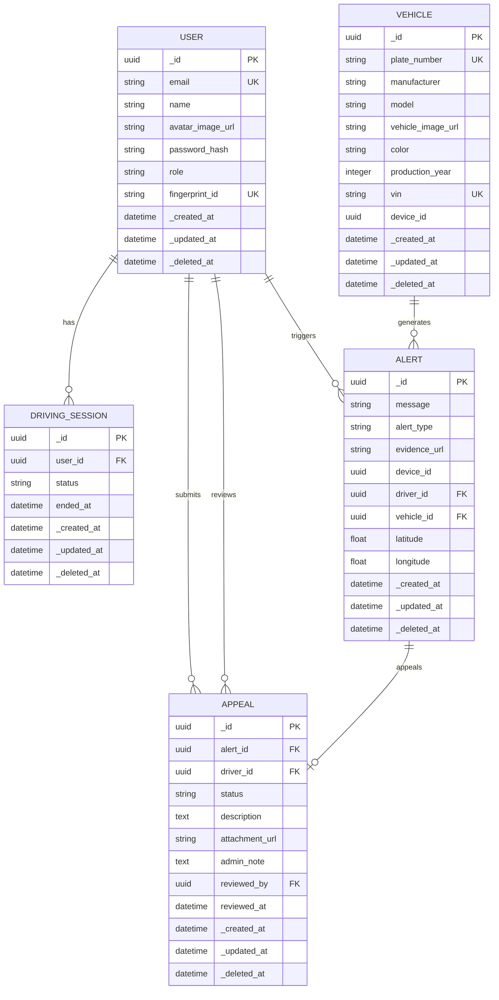

# Chương 7: Thiết Kế Cơ Sở Dữ Liệu & Sơ Đồ Thực Thể Liên Kết (ERD)

Hệ thống **RoadSentinel** sử dụng hệ quản trị cơ sở dữ liệu quan hệ **PostgresQL** làm cơ sở dữ liệu lưu trữ bền vững (Persistent Storage). Để phục vụ kiến trúc dạng mô-đun hóa (Modular Monolith) hướng dịch vụ, cơ sở dữ liệu được phân chia thành ba lược đồ (Schemas) độc lập: `user` (quản lý người dùng và ca làm việc), `vehicle` (quản lý phương tiện), và `alert` (quản lý cảnh báo hành vi AI và kháng nghị).

Ngoài ra, hệ thống tích hợp bộ nhớ đệm **Redis** hiệu năng cao để phân phối bản tin Pub/Sub thời gian thực và quản lý các phiên kết nối WebSockets.

---

## I. Sơ Đồ Thực Thể Liên Kết (Entity-Relationship Diagram - ERD)

Dưới đây là sơ đồ ERD của hệ thống được kết xuất trực tiếp bằng Mermaid thể hiện các bảng dữ liệu, kiểu dữ liệu, các ràng buộc và mối quan hệ liên kết khóa ngoại.

---

## II. Chi Tiết Từ Điển Dữ Liệu (Data Dictionary)

Tất cả các bảng dữ liệu đều được kế thừa từ lớp cơ sở `DataModel` chứa 4 cột quản lý vòng đời bản ghi hệ thống:
* `_id` (UUID làm khóa chính).
* `_created_at` (Thời gian tạo bản ghi).
* `_updated_at` (Thời gian cập nhật gần nhất).
* `_deleted_at` (Thời gian xóa logic - Soft Delete).

### 1. Schema `user` (Quản lý Người dùng & Ca chạy)

#### Bảng 1.1: `user.user` (Thông tin tài xế và quản trị viên)
Lưu trữ thông tin cá nhân, phân quyền tài khoản, thông tin đăng nhập và mã liên kết vân tay sinh trắc học.

| Tên Cột | Kiểu Dữ Liệu | Ràng Buộc | Mô Tả |
| :--- | :--- | :--- | :--- |
| **`_id`** | `UUID` | Primary Key | Khóa chính tự động sinh bằng `gen_random_uuid()` |
| **`email`** | `VARCHAR` | Unique, Indexed, Not Null | Địa chỉ thư điện tử dùng để đăng nhập hệ thống |
| **`password_hash`** | `VARCHAR` | Nullable | Mật khẩu tài khoản đã được băm (bcrypt) |
| **`name`** | `VARCHAR` | Nullable | Họ và tên đầy đủ hiển thị trên hệ thống |
| **`avatar_image_url`** | `VARCHAR` | Nullable | Đường dẫn ảnh đại diện của người dùng |
| **`role`** | `VARCHAR(32)` | Not Null (Default: "driver") | Quyền hạn tài khoản: `driver` hoặc `admin` |
| **`fingerprint_id`** | `VARCHAR` | Unique, Indexed, Nullable | Mã định danh vân tay đã liên kết trên thiết bị (vd: `FINGER_5`) |
| **`birthday`** | `DATE` | Nullable | Ngày tháng năm sinh |
| **`gender`** | `VARCHAR` | Nullable | Giới tính người dùng |
| **`address__line1`** | `VARCHAR` | Nullable | Địa chỉ dòng 1 |
| **`address__city`** | `VARCHAR` | Nullable | Thành phố cư trú |
| **`address__country`** | `VARCHAR` | Nullable | Quốc gia |
| **`_created_at`** | `TIMESTAMP WITH TZ` | Not Null | Thời điểm tài khoản được tạo |
| **`_updated_at`** | `TIMESTAMP WITH TZ` | Not Null | Thời điểm cập nhật tài khoản gần nhất |
| **`_deleted_at`** | `TIMESTAMP WITH TZ` | Nullable | Dùng để hỗ trợ xóa logic tài khoản |

#### Bảng 1.2: `user.driving_session` (Quản lý ca chạy và chấm công)
Lưu trữ thời gian bắt đầu và kết thúc lái xe thực tế để thực hiện chấm công.

| Tên Cột | Kiểu Dữ Liệu | Ràng Buộc | Mô Tả |
| :--- | :--- | :--- | :--- |
| **`_id`** | `UUID` | Primary Key | Khóa chính tự động sinh |
| **`user_id`** | `UUID` | Foreign Key, Indexed, Not Null | Liên kết tới `user.user._id` |
| **`status`** | `VARCHAR` | Not Null (Default: "ACTIVE") | Trạng thái ca chạy: `ACTIVE` hoặc `COMPLETED` |
| **`ended_at`** | `TIMESTAMP WITH TZ` | Nullable | Thời điểm tài xế quét vân tay kết thúc ca lái |
| **`_created_at`** | `TIMESTAMP WITH TZ` | Not Null | Thời điểm bắt đầu ca chạy (tương ứng quét vân tay Clock-In) |
| **`_updated_at`** | `TIMESTAMP WITH TZ` | Not Null | Thời gian cập nhật gần nhất |
| **`_deleted_at`** | `TIMESTAMP WITH TZ` | Nullable | Hỗ trợ xóa logic ca chạy |

---

### 2. Schema `vehicle` (Quản lý Phương tiện)

#### Bảng 2.1: `vehicle.vehicle` (Thông tin đội xe)
Lưu trữ thông tin kỹ thuật của xe và cấu hình liên kết mã thiết bị nhúng IoT.

| Tên Cột | Kiểu Dữ Liệu | Ràng Buộc | Mô Tả |
| :--- | :--- | :--- | :--- |
| **`_id`** | `UUID` | Primary Key | Khóa chính tự động sinh |
| **`plate_number`** | `VARCHAR` | Unique, Indexed, Not Null | Biển số kiểm soát của phương tiện (vd: `43A-123.45`) |
| **`manufacturer`** | `VARCHAR` | Nullable | Nhà sản xuất xe (vd: `Toyota`, `Ford`) |
| **`model`** | `VARCHAR` | Nullable | Dòng xe cụ thể (vd: `Ranger`, `Innova`) |
| **`vehicle_image_url`**| `VARCHAR` | Nullable | Đường dẫn hình ảnh thực tế của xe |
| **`color`** | `VARCHAR` | Nullable | Màu sắc của xe |
| **`production_year`** | `INTEGER` | Nullable | Năm sản xuất |
| **`vin`** | `VARCHAR` | Unique, Nullable | Số khung (Vehicle Identification Number) |
| **`device_id`** | `UUID` | Nullable | Mã định danh thiết bị nhúng (Smart Device) gắn trên xe |
| **`_created_at`** | `TIMESTAMP WITH TZ` | Not Null | Thời gian thêm xe vào hệ thống |
| **`_updated_at`** | `TIMESTAMP WITH TZ` | Not Null | Thời gian cập nhật gần nhất |
| **`_deleted_at`** | `TIMESTAMP WITH TZ` | Nullable | Hỗ trợ xóa logic phương tiện |

---

### 3. Schema `alert` (Quản lý Cảnh báo & Kháng nghị)

#### Bảng 3.1: `alert.alert` (Nhật ký vi phạm do AI phát hiện)
Ghi nhận mọi sự cố vi phạm được trích xuất từ mô hình xử lý ảnh YOLOv8.

| Tên Cột | Kiểu Dữ Liệu | Ràng Buộc | Mô Tả |
| :--- | :--- | :--- | :--- |
| **`_id`** | `UUID` | Primary Key | Khóa chính tự động sinh |
| **`message`** | `VARCHAR` | Not Null | Ghi chú văn bản hiển thị cảnh báo (vd: "Tài xế ngủ gật") |
| **`alert_type`** | `ENUM` | Not Null (Default: "DISTRACTED") | Phân loại vi phạm: `SLEEPING`, `USING_PHONE`, `DISTRACTED` |
| **`evidence_url`** | `VARCHAR` | Nullable | Đường dẫn ảnh vi phạm chứa bounding box trích xuất từ camera |
| **`device_id`** | `UUID` | Not Null | Mã thiết bị truyền phát dữ liệu vi phạm |
| **`driver_id`** | `UUID` | Foreign Key (Implicit), Nullable | Ánh xạ tới `user.user._id` đang có ca chạy active tại thời điểm đó |
| **`vehicle_id`** | `UUID` | Foreign Key (Implicit), Nullable | Ánh xạ tới `vehicle.vehicle._id` đang được liên kết với thiết bị |
| **`latitude`** | `FLOAT` | Nullable | Vĩ độ định vị xảy ra sự cố |
| **`longitude`** | `FLOAT` | Nullable | Kinh độ định vị xảy ra sự cố |
| **`_created_at`** | `TIMESTAMP WITH TZ` | Not Null | Thời điểm xảy ra vi phạm thực tế |
| **`_updated_at`** | `TIMESTAMP WITH TZ` | Not Null | Thời gian cập nhật |
| **`_deleted_at`** | `TIMESTAMP WITH TZ` | Nullable | Sử dụng khi kháng nghị thành công (Xóa logic để ẩn alert) |

#### Bảng 3.2: `alert.appeal` (Kháng nghị vi phạm của tài xế)
Lưu trữ thông tin giải trình của tài xế và phản hồi từ quản trị viên đối với một sự cố vi phạm.

| Tên Cột | Kiểu Dữ Liệu | Ràng Buộc | Mô Tả |
| :--- | :--- | :--- | :--- |
| **`_id`** | `UUID` | Primary Key | Khóa chính tự động sinh |
| **`alert_id`** | `UUID` | Foreign Key, Indexed, Not Null | Liên kết tới `alert.alert._id` bị khiếu nại |
| **`driver_id`** | `UUID` | Foreign Key, Indexed, Not Null | Liên kết tới `user.user._id` gửi kháng nghị |
| **`status`** | `ENUM` | Not Null (Default: "PENDING") | Trạng thái kháng nghị: `PENDING`, `APPROVED`, `REJECTED` |
| **`description`** | `TEXT` | Nullable | Văn bản giải trình lý do của tài xế |
| **`attachment_url`** | `VARCHAR` | Nullable | Ảnh bằng chứng đính kèm bác bỏ lỗi do tài xế cung cấp |
| **`admin_note`** | `TEXT` | Nullable | Ghi chú phản hồi hoặc lý do đồng ý/bác bỏ của Admin |
| **`reviewed_by`** | `UUID` | Foreign Key, Nullable | Liên kết tới `user.user._id` của quản trị viên duyệt đơn |
| **`reviewed_at`** | `TIMESTAMP WITH TZ` | Nullable | Thời gian duyệt kháng nghị chính thức |
| **`_created_at`** | `TIMESTAMP WITH TZ` | Not Null | Thời điểm gửi kháng nghị |
| **`_updated_at`** | `TIMESTAMP WITH TZ` | Not Null | Thời gian cập nhật gần nhất |
| **`_deleted_at`** | `TIMESTAMP WITH TZ` | Nullable | Hỗ trợ xóa logic |

---

## III. Các Ràng Buộc Bảo Toàn Dữ Liệu (Data Integrity)

1. **Khóa Ngoại Ràng Buộc Chặt (Hard Foreign Keys)**:
   * Bản ghi `driving_session` bắt buộc phải có `user_id` tồn tại trong bảng `user.user`. Nếu tài khoản User bị xóa, ca chạy liên quan có thể bị ảnh hưởng tùy cấu hình xóa.
2. **Khóa Ngoại Ánh Xạ Logic (Soft/Implicit Foreign Keys)**:
   * Do kiến trúc tách schema, các cột `driver_id` và `vehicle_id` trong bảng `alert.alert` không sử dụng ràng buộc khóa ngoại cứng cấp cơ sở dữ liệu để đảm bảo hiệu năng ghi chèn dữ liệu không bị block. Việc ánh xạ được đảm bảo bởi tầng ứng dụng (Application Layer) dựa trên `device_id` và thời điểm bắt đầu ca chạy hoạt động.
3. **Các Chỉ Mục Tối Ưu Hóa (Indexes)**:
   * Tất cả các trường `_id` khóa chính được tự động đánh chỉ mục B-Tree.
   * `email` và `fingerprint_id` trong bảng `user.user` được thiết lập chỉ mục `UNIQUE` để tối ưu hóa truy vấn đăng nhập và tìm kiếm vân tay thời gian thực với độ phức tạp $O(1)$.
   * `status` và `alert_id` được đánh index để tối ưu tốc độ tải danh sách kháng nghị chưa duyệt (Pending First) trên Dashboard.

---

## IV. Thiết Kế Cơ Sở Dữ Liệu Tạm Thời & Phân Phối Sự Kiện (Redis Engine)

Bên cạnh PostgresQL, hệ thống sử dụng **Redis** cho các hoạt động thời gian thực đòi hỏi độ trễ cực thấp:
1. **Quản lý Cặp Khóa - Giá Trị (Key-Value State)**:
   * Lưu thông tin các camera đang livestream hoạt động: `active_streams: {vehicle_id: ws_connection_id}`.
   * Lưu trữ đệm token xác thực người dùng để tránh truy vấn liên tục vào cơ sở dữ liệu Postgres.
2. **Kênh Truyền Tin Event-Driven (Pub/Sub)**:
   * Khi AI Engine phát hiện vi phạm, nó đẩy tin nhắn lên kênh Redis Pub/Sub: `redis.publish("alert_channel", payload)`.
   * FastAPI WebSocket Gateway lắng nghe kênh này và phân phối sự kiện tức thì tới đúng kết nối trình duyệt của Admin Dashboard đang mở, giúp giảm thiểu tải xử lý CPU cho server chính.
