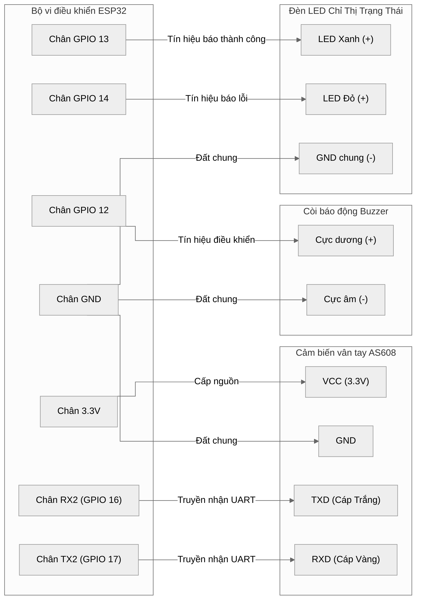

# Chương 5: Thiết Kế Sơ Đồ Phần Cứng (Hardware Wiring & Connections)

Hệ thống **RoadSentinel** sử dụng hai cụm thiết bị phần cứng độc lập được đặt trên xe để phục vụ giám sát hình ảnh AI và xác thực sinh trắc học vân tay / báo động vật lý.

Dưới đây là chi tiết sơ đồ chân (pin mapping) và thiết kế mạch kết nối của hai cụm thiết bị nhúng này.

---

## 1. Cụm Thiết Bị 1: Camera Cabin (ESP32-CAM & OV2640)

Cụm thiết bị này đóng vai trò ghi nhận luồng hình ảnh MJPEG từ cabin xe gửi về server.

### Sơ đồ chân kết nối nạp chương trình (FTDI USB-to-TTL)
Vì mạch ESP32-CAM không tích hợp sẵn chip nạp USB-UART, chúng ta cần sử dụng mạch nạp FTDI bên ngoài để nạp chương trình (PlatformIO / Arduino IDE):

| Chân ESP32-CAM | Chân Mạch Nạp FTDI | Chức Năng |
| :--- | :--- | :--- |
| **5V** | **VCC (5V)** | Nguồn cấp cho ESP32-CAM |
| **GND** | **GND** | Chân đất chung |
| **U0R (GPIO 3)** | **TXD** | Chân nhận dữ liệu UART |
| **U0T (GPIO 1)** | **RXD** | Chân truyền dữ liệu UART |
| **GPIO 0** | **GND** | **QUAN TRỌNG**: Nối GND để đưa chip vào chế độ FLASH (Nạp). Rút ra khi chạy thực tế. |

### Cấu hình camera OV2640 trên mạch ESP32-CAM (AI-Thinker model)
Camera OV2640 kết nối trực tiếp vào socket trên mạch ESP32-CAM với cấu hình chân phần cứng mặc định như sau:
* **D0 - D7 (Data Bus)**: GPIO 5, 18, 19, 21, 36, 39, 34, 35
* **XCLK (Hệ thống clock)**: GPIO 0
* **PCLK (Pixel clock)**: GPIO 22
* **VSYNC (Đồng bộ dọc)**: GPIO 25
* **HREF (Đồng bộ ngang)**: GPIO 23
* **SDA / SCL (Giao tiếp I2C cấu hình camera)**: GPIO 26 / GPIO 27
* **Reset**: GPIO 30
* **Power Down (PWDN)**: GPIO 32

---

## 2. Cụm Thiết Bị 2: Xác Thực Vân Tay & Báo Động (ESP32 NodeMCU)

Cụm này bao gồm bo mạch ESP32 kết nối với cảm biến vân tay quang học (AS608 hoặc DY50), còi báo động Buzzer, và hệ thống đèn LED trạng thái.

### Sơ đồ kết nối dây phần cứng (Wiring Diagram)

### Bảng sơ đồ nối chân chi tiết (Pin Mapping Table)

| Thiết bị ngoại vi | Chân ngoại vi | Chân kết nối ESP32 | Ghi chú kỹ thuật |
| :--- | :--- | :--- | :--- |
| **Cảm biến vân tay AS608** | **VCC** | **3V3** | Yêu cầu nguồn cấp 3.3V ổn định |
| | **GND** | **GND** | Nối đất chung |
| | **TXD** | **GPIO 16 (RX2)** | Giao tiếp Serial Hardware 2 |
| | **RXD** | **GPIO 17 (TX2)** | Giao tiếp Serial Hardware 2 |
| **Còi báo động Buzzer** | **Cực dương (+)** | **GPIO 12** | Kích hoạt mức cao (HIGH) để còi kêu |
| | **Cực âm (-)** | **GND** | Nối đất chung |
| **Đèn LED báo hiệu** | **Chân LED Xanh** | **GPIO 13** | Sáng khi xác thực thành công / Clock-In |
| | **Chân LED Đỏ** | **GPIO 14** | Sáng khi vân tay sai hoặc lỗi HMAC |
| | **Chân GND** | **GND** | Sử dụng điện trở hạn dòng 220 Ohm |

---

## 3. Sơ Đồ Đi Nguồn Hệ Thống (Power Supply Schema)

Để hệ thống hoạt động ổn định trên xe ô tô (sử dụng nguồn điện 12V-24V từ tẩu thuốc hoặc ắc quy):
* Cần sử dụng **mạch hạ áp DC-to-DC Buck Converter** (ví dụ: LM2596) để hạ nguồn 12V/24V xuống **5.0V** ổn định.
* Nguồn 5V này sẽ được cấp song song cho chân `5V` trên ESP32-CAM và chân `VIN / 5V` trên ESP32 NodeMCU.
* Dòng điện tối thiểu yêu cầu cho cụm thiết bị là **2.0A**, do ESP32-CAM tiêu thụ dòng rất lớn (lên tới 1A) khi truyền luồng ảnh qua WiFi và nháy đèn flash.
