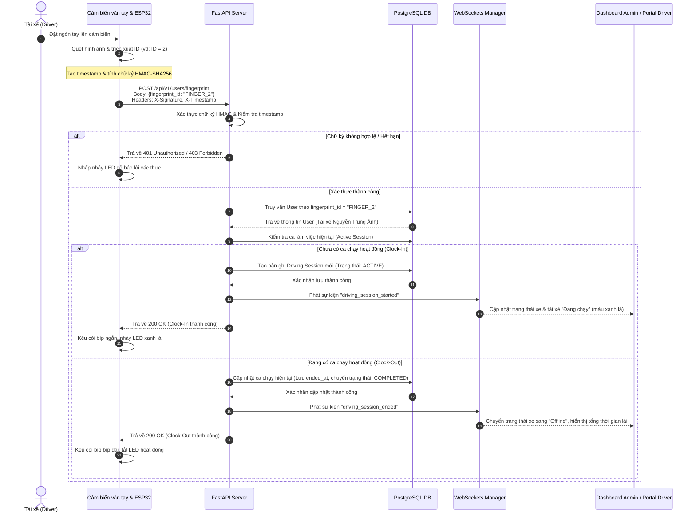
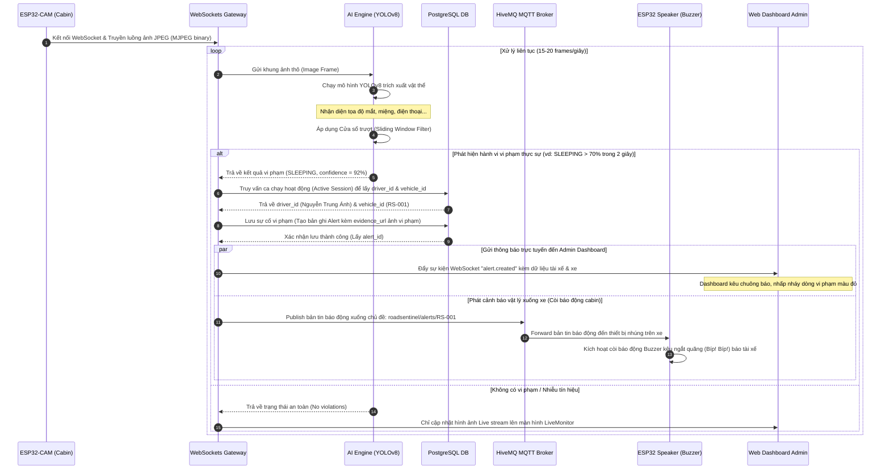
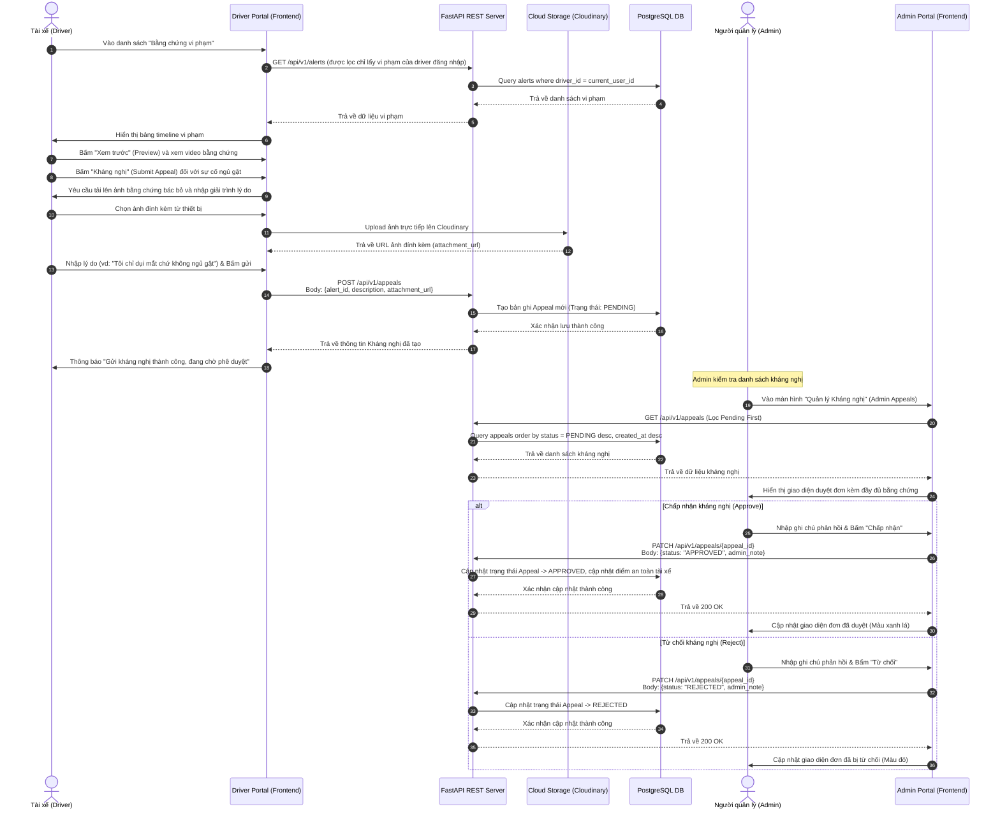

# Chương 4: Triển Khai Kỹ Thuật & Sơ Đồ Tuần Tự (Sequence Diagrams)

Phần này phân tích chi tiết quy trình hoạt động của ba luồng nghiệp vụ cốt lõi trong hệ thống **RoadSentinel** bằng biểu đồ tuần tự (Sequence Diagram) sử dụng Mermaid.

---

## 1. Quy Trình Chấm Công Sinh Trắc Học Tích Hợp Bảo Mật HMAC

Quy trình này xảy ra khi tài xế thực hiện quét vân tay để Clock-In (bắt đầu lái) hoặc Clock-Out (kết thúc lái) trên thiết bị nhúng đặt trong cabin.

### Biểu đồ tuần tự (Sequence Diagram)

---

## 2. Quy Trình Giám Sát Hành Vi AI & Phát Cảnh Báo Thời Gian Thực

Quy trình này thể hiện cách thức luồng hình ảnh từ cabin được xử lý bằng AI để phát hiện vi phạm và đồng bộ cảnh báo vật lý trên xe lẫn Dashboard của quản trị viên.

### Biểu đồ tuần tự (Sequence Diagram)

---

## 3. Quy Trình Kháng Nghị Vi Phạm (Appeals Workflow)

Quy trình này thể hiện sự tương tác giữa tài xế và quản trị viên khi tài xế gửi đơn khiếu nại đối với một sự cố vi phạm mà hệ thống AI ghi nhận.

### Biểu đồ tuần tự (Sequence Diagram)

---

## 4. Các Thông Số Ngưỡng (Threshold Parameters) & Tham Số Cấu Hình Hệ Thống

Để đảm bảo hệ thống vận hành ổn định, chính xác và giảm thiểu tối đa hiện tượng cảnh báo sai (False Alarms) mà không làm mất đi các sự cố nguy hiểm thực tế, các thông số ngưỡng kỹ thuật dưới đây đã được nghiên cứu và thiết lập cấu hình trong mã nguồn:

### 4.1. Ngưỡng Tự Tin Phát Hiện Vật Thể (YOLOv8 Confidence Threshold)
* **Ký hiệu**: $\theta_{conf}$
* **Giá trị thiết lập**: `0.50` (50%)
* **Ý nghĩa**: Đây là độ tin cậy tối thiểu mà mô hình YOLOv8 trích xuất được cho mỗi lớp đối tượng (mắt nhắm, dùng điện thoại, vô lăng...) để được chấp nhận đưa vào giải thuật xử lý tiếp theo.
* **Lý do**: Thiết lập ở mức 50% giúp đảm bảo không bỏ sót các trường hợp tài xế hơi nghiêng mặt làm khuất một phần mắt, đồng thời đủ cao để loại bỏ các vật thể nền trong cabin bị nhận diện nhầm.

### 4.2. Tham Số Cửa Sổ Thời Gian Trượt (Sliding Window Duration)
* **Ký hiệu**: $W_{duration}$
* **Giá trị thiết lập theo hành vi**:
  * **Ngủ gật / Buồn ngủ nặng (`SLEEPING` / `DROWSY`)**: $W_{sleep} = 2.5$ giây.
  * **Sử dụng điện thoại (`USING_PHONE`)**: $W_{phone} = 1.5$ giây.
  * **Mất tập trung / Ngoảnh mặt đi (`DISTRACTED`)**: $W_{dist} = 3.0$ giây.
* **Ý nghĩa**: Khoảng thời gian (giây) liên tiếp mà hệ thống thu thập dữ liệu khung hình (frames) để đánh giá hành vi.
* **Lý do**: 
  * Chu kỳ nháy mắt tự nhiên của con người diễn ra trong vòng 0.1 đến 0.4 giây. Việc đặt cửa sổ ngủ gật là 2.5 giây đảm bảo loại trừ hoàn toàn việc nháy mắt sinh học, chỉ kích hoạt khi tài xế thực sự nhắm mắt ngủ gật.
  * Việc đưa điện thoại lên tai chỉ cần 1.5 giây để nhận biết và cảnh báo sớm vì đây là hành vi cực kỳ nguy hiểm trực tiếp khi xe đang di chuyển.

### 4.3. Ngưỡng Tỉ Lệ Khung Hình Vi Phạm (Violation Ratio Threshold)
* **Ký hiệu**: $\theta_{ratio}$
* **Giá trị thiết lập**: `0.70` (70%)
* **Ý nghĩa**: Tỉ lệ phần trăm số lượng frame ghi nhận hành vi vi phạm trên tổng số frame thu được trong cửa sổ thời gian trượt $W$.
* **Công thức kích hoạt**: 
$$\text{Trigger Alert} = \text{True} \iff \frac{N_{vi\_pham}}{N_{tong}} \ge 0.70$$
* **Lý do**: Khi camera truyền luồng ảnh MJPEG, có thể có từ 1-2 frame bị nhòe hình (motion blur) do xe đi qua chỗ xóc dẫn đến AI phán đoán sai lệch. Ngưỡng 70% đảm bảo rằng nếu có vài frame nhận diện lỗi đơn lẻ xen kẽ giữa các frame bình thường, còi báo động vẫn sẽ không kêu, giảm thiểu hoàn toàn sự ức chế cho tài xế.

### 4.4. Ngưỡng Thời Gian Xác Thực HMAC (HMAC Time Window Offset)
* **Ký hiệu**: $T_{offset}$
* **Giá trị thiết lập**: `30` giây
* **Ý nghĩa**: Khoảng thời gian chênh lệch tối đa cho phép giữa timestamp đính kèm trong request gửi từ thiết bị nhúng (`X-Timestamp`) và thời gian thực nhận yêu cầu của máy chủ Backend.
* **Lý do**: Khoảng lệch 30 giây đủ rộng để bù đắp cho độ trễ truyền dẫn mạng di động (4G/5G) tại các vùng sóng yếu, nhưng đủ ngắn để chặn đứng hoàn toàn các cuộc tấn công gửi lại (Replay Attacks) - nơi kẻ tấn công đánh cắp gói tin chấm công cũ và phát lại sau đó nhiều giờ.

