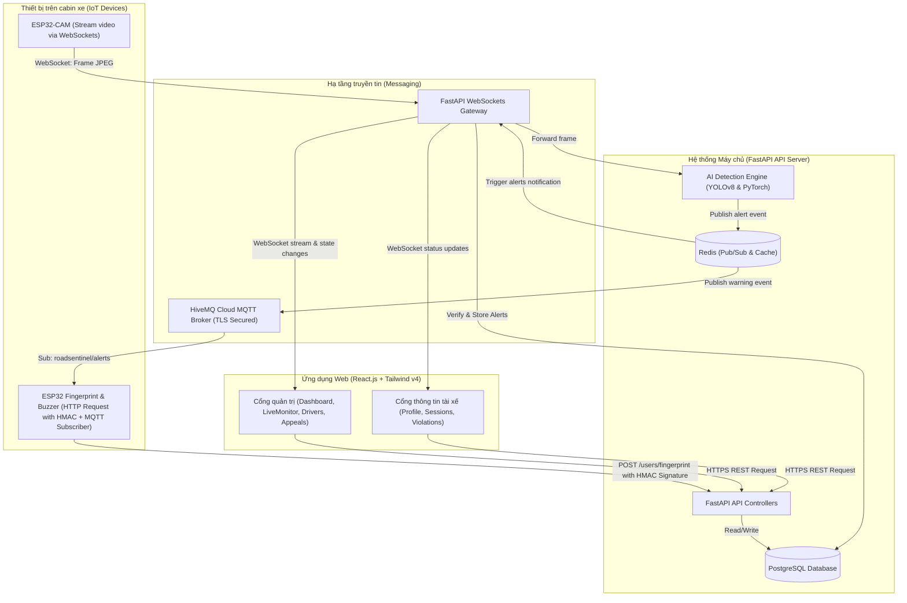

# Chương 1: Tổng Quan Đề Tài & Kiến Trúc Hệ Thống (RoadSentinel)

## 1. Lý Do Chọn Đề Tài (Business & Technical Context)

### Bối Cảnh Thực Tế & Lý Do Business
Trong ngành vận tải và logistics, an toàn giao thông là yếu tố cốt lõi quyết định sự sống còn của doanh nghiệp. Theo các số liệu thống kê từ Ủy ban An toàn Giao thông Quốc gia, hơn 80% các vụ tai nạn giao thông liên quan đến xe thương mại (xe tải, xe khách, container) xuất phát từ lỗi chủ quan của tài xế:
* **Mệt mỏi và ngủ gật**: Tài xế chạy ca đêm liên tục hoặc quá giờ quy định mà không được kiểm soát.
* **Mất tập trung**: Hành vi sử dụng điện thoại di động khi lái xe, xao nhãng khỏi mặt đường.
* **Quản lý thủ công**: Các doanh nghiệp vận tải gặp khó khăn trong việc giám sát hành vi lái xe thực tế của tài xế theo thời gian thực và quản lý thời gian làm việc (chấm công) một cách minh bạch.

**RoadSentinel** được phát triển nhằm giải quyết triệt để bài toán này bằng cách cung cấp một giải pháp giám sát thông minh toàn diện, giúp doanh nghiệp:
1. **Giảm thiểu tai nạn**: Phát hiện sớm các hành vi nguy hiểm để cảnh báo tức thời cho tài xế và điều hành viên.
2. **Minh bạch hóa chấm công**: Sử dụng xác thực sinh trắc học (vân tay) trực tiếp từ xe để ghi nhận thời gian lái xe thực tế, ngăn chặn gian lận chấm công hộ.
3. **Tối ưu hóa quản lý**: Cung cấp công cụ phân tích điểm an toàn, quản lý phương tiện và xử lý khiếu nại (Appeals) công bằng.

### Khía Cạnh Kỹ Thuật (Technical Context)
Hệ thống kết hợp các công nghệ hiện đại thuộc ba lĩnh vực:
* **IoT (Internet of Things)**: Thiết bị nhúng ESP32-CAM và cảm biến sinh trắc học vân tay đặt trên cabin xe để thu thập hình ảnh và xác thực danh tính tài xế.
* **AI (Artificial Intelligence)**: Mô hình học sâu YOLOv8 tối ưu hóa chạy trên máy chủ để phân tích thời gian thực hình ảnh từ cabin xe nhằm nhận diện các hành vi vi phạm.
* **Web & Real-time Communication**: Sử dụng FastAPI (Python) hiệu năng cao kết hợp với giao thức WebSockets và MQTT để truyền tải dữ liệu thời gian thực độ trễ thấp (< 100ms) đến giao diện Web React.js của doanh nghiệp.

---

## 2. Mục Tiêu Đề Tài

Hệ thống đặt ra 4 mục tiêu kỹ thuật lớn:
1. **Xác thực sinh thực học bảo mật**: Chấm công vân tay trên thiết bị nhúng truyền về server thông qua chữ ký bảo mật HMAC-SHA256 nhằm chống giả mạo gói tin.
2. **Giám sát hành vi AI thời gian thực**: Phát hiện chính xác các trạng thái vi phạm: Buồn ngủ (Drowsy), Ngủ gật (Sleeping), Dùng điện thoại (Using Phone), Xao nhãng (Distracted), Lệch làn đường (Lane Departure).
3. **Phát và truyền tải cảnh báo độ trễ thấp**: Khi phát hiện vi phạm, hệ thống tự động phát tín hiệu MQTT kích hoạt còi báo động vật lý trên xe, đồng thời đẩy thông báo WebSocket tức thời lên Dashboard của người quản trị.
4. **Quy trình khiếu nại khép kín (Appeals Workflow)**: Cho phép tài xế xem lại bằng chứng vi phạm (ảnh/video) và gửi kháng nghị trực tiếp từ cổng thông tin cá nhân; quản trị viên có thể duyệt hoặc từ chối kháng nghị một cách trực quan.

---

## 3. Kiến Trúc Tổng Thể Hệ Hệ Thống

Hệ thống được thiết kế theo kiến trúc hướng dịch vụ (Service-Oriented Architecture - SOA) kết hợp với mô hình Event-Driven dựa trên MQTT và WebSockets.

### Giải thích các thành phần kiến trúc:
1. **IoT Cabin**:
   * **ESP32-CAM**: Đảm nhận vai trò truyền phát luồng hình ảnh (MJPEG over WebSockets) từ cabin xe về máy chủ để xử lý AI.
   * **ESP32 Core**: Kết nối với cảm biến vân tay để xác thực tài xế. Mọi dữ liệu HTTP truyền đi đều được ký HMAC bằng khóa dùng chung nhằm tránh các cuộc tấn công thay đổi thông tin (Tampering) và tấn công gửi lại (Replay Attacks). Nó cũng lắng nghe các lệnh cảnh báo từ MQTT để kích hoạt còi báo động (Buzzer).
2. **FastAPI Backend**:
   * **WebSockets Gateway**: Xử lý các kết nối luồng video trực tiếp từ xe và đẩy dữ liệu phân tích thời gian thực lên giao diện web.
   * **AI Detection Engine**: Nhận các khung ảnh thô từ WebSocket, đưa qua mô hình YOLOv8 để trích xuất vật thể và tư thế mặt, sau đó áp dụng giải thuật lọc nhiễu cửa sổ trượt (Sliding Window) để đưa ra cảnh báo chính xác.
   * **REST API controllers**: Quản lý nghiệp vụ về phân quyền, phương tiện, tài xế, dữ liệu chấm công và kháng nghị.
3. **Database & Cache**:
   * **PostgreSQL**: Lưu trữ thông tin có cấu trúc về người dùng, lịch sử ca làm việc (driving sessions), thông tin xe, lịch sử vi phạm (alerts) và các khiếu nại (appeals).
   * **Redis**: Lưu trữ tạm thời trạng thái kết nối thiết bị và điều phối giao tiếp bất đồng bộ giữa AI Engine và WebSocket thông qua cơ chế Pub/Sub.
4. **React.js Frontend**:
   * Giao diện quản trị viên và giao diện dành riêng cho tài xế, được thiết kế đồng bộ với hệ thống màu sắc trực quan (Material Design 3 sử dụng Tailwind v4), hỗ trợ đa ngôn ngữ Anh-Việt, tương thích hoàn toàn trên cả thiết bị di động và máy tính.
