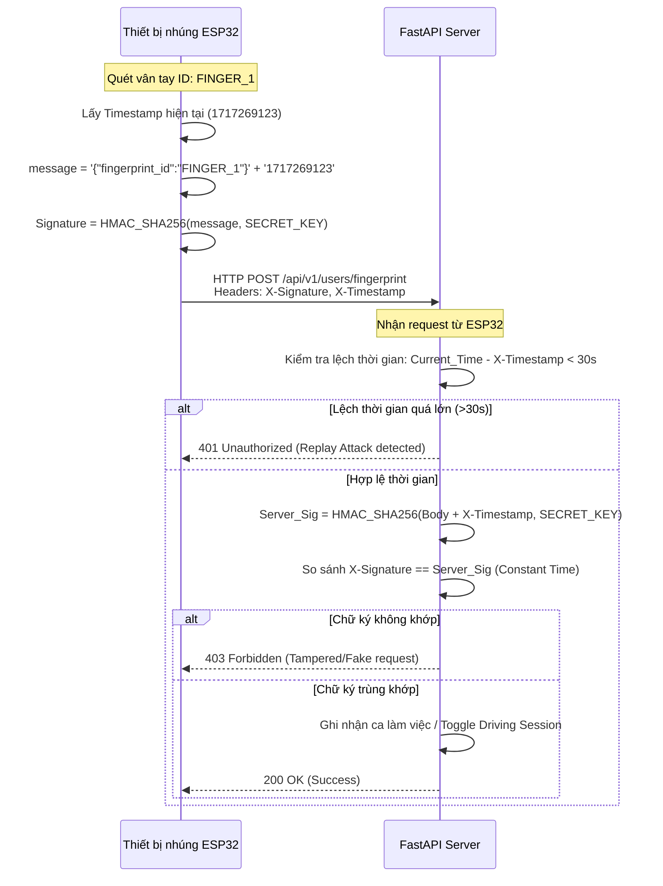

# Chương 3: Cơ Sở Lý Thuyết & Thuật Toán Cốt Lõi

Hệ thống **RoadSentinel** sử dụng ba trụ cột thuật toán cốt lõi để giải quyết các vấn đề về xử lý hình ảnh AI, ổn định tín hiệu điều khiển và bảo mật truyền tin IoT.

---

## 1. Phát Hiện Hành Vi Tài Xế Với Mô Hình Học Sâu YOLOv8

**YOLOv8 (You Only Look Once version 8)** là một mô hình mạng nơ-ron tích chập (CNN) hiện đại cho bài toán phát hiện đối tượng (Object Detection) và phân đoạn ảnh (Segmentation). Mô hình này được huấn luyện đặc biệt để nhận diện các trạng thái hành vi tài xế trong cabin:

### Các Lớp Đối Tượng Nhận Diện (Detections Classes)
1. **Mắt Nhắm/Mắt Mở (Eyes Closed / Eyes Open)**: Dùng để tính toán chỉ số nhắm mắt liên tục nhằm phát hiện buồn ngủ hoặc ngủ gật.
2. **Miệng Há/Ngáp (Yawning / Mouth Open)**: Dấu hiệu của sự mệt mỏi thể chất.
3. **Điện thoại di động (Cell Phone)**: Phát hiện tài xế cầm hoặc áp điện thoại lên tai khi đang lái xe.
4. **Vô lăng (Steering Wheel) & Tay tài xế (Hands on Wheel)**: Đảm bảo tài xế luôn đặt tay lên vô lăng khi xe đang di chuyển.
5. **Đầu lệch/Ngoảnh mặt (Head Turned / Distracted)**: Nhận diện xao nhãng khi hướng nhìn của tài xế lệch khỏi hướng kính lái quá lâu.

### Phân Loại Mức Độ Nghiêm Trọng Của Sự Cố (Alert Severity Levels)
Server Backend phân loại sự cố dựa trên mức độ nguy hiểm đối với an toàn tính mạng:
* **Nghiêm trọng (Critical)**: `COLLISION` (Va chạm), `SLEEPING` (Ngủ gật), `DROWSY` (Buồn ngủ nặng), `USING_PHONE` (Sử dụng điện thoại). Những hành vi này lập tức kích hoạt còi báo động vật lý trên xe qua MQTT và đẩy cảnh báo đẩy (push alert) tức thì.
* **Cảnh báo (Moderate)**: `DISTRACTED` (Xao nhãng), `LANE_DEPARTURE` (Lệch làn), `TAILGATING` (Bám đuôi quá gần). Kích hoạt cảnh báo nhẹ hoặc lưu lịch sử để trừ điểm an toàn.
* **Khuyên cáo (Advisory)**: `YAWNING` (Ngáp ngắn), `NO_HANDS` (Buông tay khỏi vô lăng thời gian ngắn).

---

## 2. Thuật Toán Cửa Sổ Trượt Lọc Nhiễu Tín Hiệu AI (Sliding Window Algorithm)

### Tại sao cần thuật toán lọc nhiễu?
Trong quá trình phát hiện đối tượng bằng AI trên luồng video thời gian thực, kết quả dự đoán của từng frame đơn lẻ thường bị dao động liên tục (noise/flicker) do:
* Ánh sáng cabin thay đổi đột ngột (đi qua hầm, bóng cây, ánh đèn ban đêm).
* Góc nghiêng của mặt hoặc tài xế chớp mắt tự nhiên (chỉ kéo dài 100-300ms) bị mô hình nhận diện nhầm thành trạng thái ngủ gật (`SLEEPING`).

Nếu hệ thống ngay lập tức kích hoạt còi báo động hoặc ghi nhận vi phạm khi chỉ có **1 frame** đơn lẻ bị dự đoán là ngủ gật, tài xế sẽ gặp hiện tượng **False Alarms (cảnh báo giả liên tục)**, gây ức chế tâm lý và làm giảm độ tin cậy của hệ thống.

Để khắc phục, **RoadSentinel** áp dụng giải thuật **Cửa sổ trượt theo thời gian (Time-based Sliding Window)**.

### Nguyên lý hoạt động của Cửa sổ trượt lọc nhiễu
Thuật toán duy trì một danh sách các kết quả dự đoán gần nhất trong một khoảng thời gian trượt $W$ (ví dụ: $W = 2.0$ giây). 
* Gọi $N$ là tổng số khung hình nhận được từ camera trong cửa sổ thời gian $W$.
* Gọi $N_{vi\_pham}$ là số lượng khung hình mà mô hình AI nhận diện được trạng thái vi phạm (ví dụ: `SLEEPING`) trong cửa sổ $W$.
* Ta tính tỉ lệ vi phạm trong cửa sổ trượt: 
$$P = \frac{N_{vi\_pham}}{N}$$
* Sự cố chỉ chính thức được ghi nhận và kích hoạt báo động khi tỉ lệ vi phạm $P$ vượt quá một ngưỡng kích hoạt xác định $\theta$ (ví dụ: $\theta = 0.70$ hay $70\%$).

### Hình vẽ minh họa Cửa sổ trượt
```
Trục thời gian (Thời gian thực trôi từ trái sang phải)
[ Frame 1: OK ] -> [ Frame 2: OK ] -> [ Frame 3: Sleeping ] -> [ Frame 4: Sleeping ] -> [ Frame 5: Sleeping ]
|<---------------------------- Cửa sổ trượt W = 2 giây ---------------------------->|
Tỉ lệ vi phạm P = 3 / 5 = 60%. Ngưỡng kích hoạt Theta = 70% => KHÔNG BÁO ĐỘNG (Chỉ nháy mắt/nhiễu).

Tiếp tục trượt sang phải:
[ Frame 2: OK ] -> [ Frame 3: Sleeping ] -> [ Frame 4: Sleeping ] -> [ Frame 5: Sleeping ] -> [ Frame 6: Sleeping ]
|<---------------------------- Cửa sổ trượt W = 2 giây ---------------------------->|
Tỉ lệ vi phạm P = 4 / 5 = 80%. Ngưỡng kích hoạt Theta = 70% => KÍCH HOẠT BÁO ĐỘNG NGỦ GẬT (Thực sự ngủ gật).
```

### Thuật toán bằng mã giả (Pseudocode)
```python
class SlidingWindowFilter:
    def __init__(self, window_duration_seconds: float = 2.0, threshold_ratio: float = 0.7):
        self.window_duration = window_duration_seconds
        self.threshold_ratio = threshold_ratio
        self.frames_history = []  # Danh sách lưu các tuple (timestamp, is_violating)

    def add_frame_event(self, timestamp: float, is_violating: bool) -> bool:
        # 1. Thêm sự kiện mới vào lịch sử
        self.frames_history.append((timestamp, is_violating))
        
        # 2. Loại bỏ các khung hình nằm ngoài cửa sổ thời gian trượt W
        cutoff_time = timestamp - self.window_duration
        self.frames_history = [f for f in self.frames_history if f[0] >= cutoff_time]
        
        # 3. Tính toán tỉ lệ vi phạm
        total_frames = len(self.frames_history)
        if total_frames == 0:
            return False
            
        violating_frames = sum(1 for f in self.frames_history if f[1] is True)
        violation_ratio = violating_frames / total_frames
        
        # 4. Kiểm tra điều kiện kích hoạt cảnh báo vi phạm
        return violation_ratio >= self.threshold_ratio
```

---

## 3. Bảo Mật Thiết Bị IoT Với Chữ Ký HMAC-SHA256

### Nguy cơ bảo mật
Trong môi trường doanh nghiệp, tài xế hoặc kẻ xấu có thể thực hiện tấn công giả mạo (Spoofing) bằng cách sử dụng các công cụ như Postman để gửi trực tiếp yêu cầu HTTP POST giả lập chấm công quét vân tay lên server nhằm mục đích chấm công hộ hoặc thay đổi dữ liệu ca chạy.

### Giải pháp xác thực gói tin bằng chữ ký HMAC-SHA256
Để đảm bảo yêu cầu HTTP POST thực sự phát ra từ thiết bị phần cứng vật lý đặt trên xe, **RoadSentinel** triển khai cơ chế ký và xác thực chữ ký khóa mã hóa đối xứng **HMAC-SHA256 (Hash-based Message Authentication Code)**:

1. **Khóa dùng chung (Shared Secret Key)**: Server và thiết bị ESP32 cùng lưu trữ một chuỗi khóa bí mật `HMAC_SECRET_KEY` được cấu hình an toàn, không truyền qua mạng.
2. **Quá trình ký trên Thiết bị IoT (ESP32)**:
   * Thiết bị lấy mốc thời gian hiện tại (`Timestamp`) và tạo dữ liệu gửi đi (JSON chứa `fingerprint_id`).
   * Thiết bị nối chuỗi (Concatenate) dữ liệu gửi đi và Timestamp: `message = body_content + timestamp`.
   * Thiết bị tính chữ ký mã hóa: 
     $$Signature = HMAC\_SHA256(message, HMAC\_SECRET\_KEY)$$
   * Thiết bị gửi yêu cầu HTTP POST kèm hai tiêu đề (Headers):
     * `X-Timestamp`: Thời gian tạo yêu cầu.
     * `X-Signature`: Chữ ký đã được tính toán.
3. **Quá trình kiểm tra chữ ký trên Server**:
   * Server nhận yêu cầu, đọc `body`, `X-Timestamp` và `X-Signature`.
   * **Chống tấn công gửi lại (Replay Attack)**: Server so sánh `X-Timestamp` với thời gian hiện tại của server. Nếu khoảng lệch vượt quá $30$ giây, server lập tức từ chối yêu cầu.
   * Server tự tính lại chữ ký bằng khóa bí mật lưu trên server:
     $$Server\_Signature = HMAC\_SHA256(body + X\_Timestamp, HMAC\_SECRET\_KEY)$$
   * Server so sánh hai chữ ký bằng thuật toán so sánh chuỗi thời gian không đổi (Constant-time comparison) để chống Side-channel attack:
     * Nếu trùng khớp: Chấp nhận yêu cầu và thực hiện Clock-In/Clock-Out.
     * Nếu không khớp: Trả về lỗi `401 Unauthorized` hoặc `403 Forbidden`.


