# Chương 6: Sơ Đồ Use Case Tiêu Biểu & Đặc Tả Chi Tiết (Typical Use Cases)

Để phân tích rõ nét các hành vi tương tác giữa người dùng (Tài xế, Quản trị viên), thiết bị phần cứng (ESP32, ESP32-CAM) và hệ thống phần mềm **RoadSentinel**, chương này trình bày sơ đồ Use Case tổng thể cùng với đặc tả chi tiết cho 10 Use Case tiêu biểu nhất của dự án.

---

## I. Sơ Đồ Use Case Tổng Thể Hệ Thống (System Use Case Diagram)

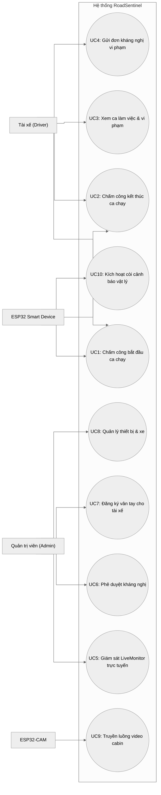

---

## II. Đặc Tả Chi Tiết 10 Use Case Tiêu Biểu (Detailed Use Case Specifications)

### 1. UC1: Chấm Công Bắt Đầu Ca Chạy (Clock-In by Fingerprint)

#### 1.1. Sơ đồ Use Case phân rã
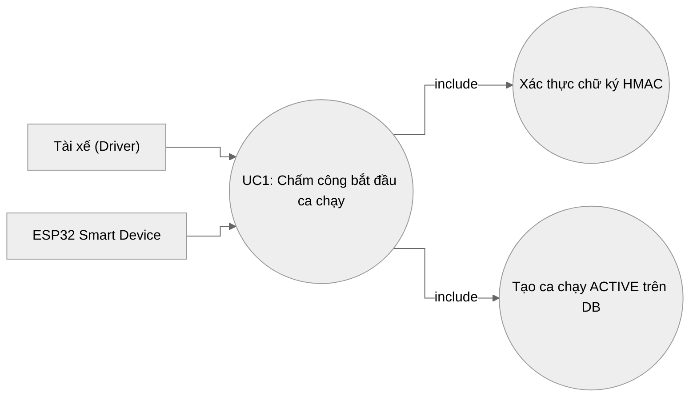

#### 1.2. Bảng đặc tả chi tiết
| Mục tiêu | Mô tả chi tiết |
| :--- | :--- |
| **Tên Use Case** | UC1: Chấm công bắt đầu ca chạy (Clock-In) |
| **Tác nhân (Actors)** | Tài xế (Driver), Thiết bị nhúng ESP32 |
| **Mục đích** | Xác thực danh tính sinh trắc học của tài xế trực tiếp trên xe để khởi tạo ca làm việc an toàn. |
| **Tiền điều kiện** | Thiết bị ESP32 đã được liên kết với xe thông qua `device_id`. Vân tay tài xế đã được đăng ký trên hệ thống. |
| **Luồng xử lý chính** | 1. Tài xế đặt ngón tay lên đầu quét vân tay AS608 trên xe. 2. Cảm biến trích xuất vân tay, đối chiếu thành công và trả về ID vân tay. 3. ESP32 sinh timestamp hiện tại, tạo chữ ký số HMAC-SHA256 kết hợp dữ liệu vân tay và timestamp sử dụng `HMAC_SECRET_KEY`. 4. ESP32 gửi HTTP POST request chứa dữ liệu và các Header chữ ký lên server. 5. Server giải mã, kiểm tra timestamp chống tấn công gửi lại (Replay Attack) và đối chiếu chữ ký. 6. Server truy vấn tài khoản tài xế, tạo bản ghi ca chạy mới ở trạng thái `ACTIVE` trong cơ sở dữ liệu. 7. Server trả về kết quả 200 OK. ESP32 nháy đèn LED xanh lá cây và kêu còi bíp ngắn chỉ thị thành công. |
| **Luồng ngoại lệ** | * **Chữ ký HMAC sai / Hết hạn**: Server từ chối (401/403). ESP32 nháy LED đỏ báo hiệu lỗi. * **Mất kết nối mạng**: ESP32 không thể kết nối tới server, còi kêu 3 tiếng dài để cảnh báo tài xế kiểm tra lại sóng di động. |
| **Hậu điều kiện** | Một ca làm việc mới của tài xế được tạo với trạng thái `ACTIVE`. Trạng thái xe trên Dashboard chuyển sang màu xanh lá cây. |

---

### 2. UC2: Chấm Công Kết Thúc Ca Chạy (Clock-Out by Fingerprint)

#### 2.1. Sơ đồ Use Case phân rã
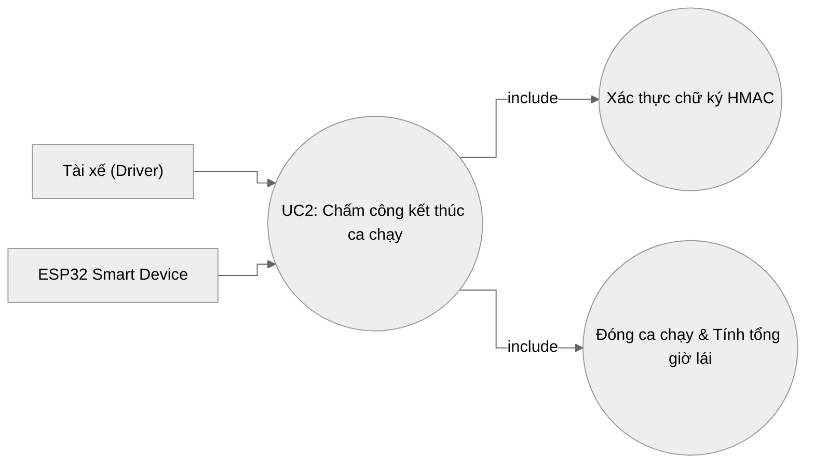

#### 2.2. Bảng đặc tả chi tiết
| Mục tiêu | Mô tả chi tiết |
| :--- | :--- |
| **Tên Use Case** | UC2: Chấm công kết thúc ca chạy (Clock-Out) |
| **Tác nhân (Actors)** | Tài xế (Driver), Thiết bị nhúng ESP32 |
| **Mục đích** | Đóng ca làm việc hiện tại, ghi nhận mốc kết thúc lái xe và tổng hợp thời gian vận hành thực tế. |
| **Tiền điều kiện** | Tài xế đang có ca làm việc ở trạng thái `ACTIVE` trên hệ thống. |
| **Luồng xử lý chính** | 1. Khi dừng xe kết thúc hành trình, tài xế đặt ngón tay lên cảm biến vân tay. 2. Cảm biến xác nhận ID vân tay hợp lệ. 3. ESP32 tạo mã ký HMAC và gửi request POST đóng ca lên server. 4. Server xác thực bảo mật thành công, tìm kiếm ca chạy `ACTIVE` của tài xế. 5. Server cập nhật trường `ended_at`, chuyển trạng thái ca chạy sang `COMPLETED`, và tính toán tổng số giờ lái xe lưu vào Database. 6. Server phản hồi thành công. ESP32 tắt đèn LED trạng thái và còi kêu bíp bíp dài kết thúc ca. |
| **Luồng ngoại lệ** | * **Không tìm thấy ca chạy ACTIVE**: Server trả về thông báo lỗi. ESP32 nháy đèn LED đỏ cảnh báo tài xế chưa từng Clock-In trước đó. |
| **Hậu điều kiện** | Ca làm việc chuyển sang trạng thái `COMPLETED`. Tổng giờ lái của tài xế được cộng dồn vào hệ thống tính điểm và lương. |

---

### 3. UC3: Xem Ca Làm Việc & Vi Phạm Cá Nhân (View Timekeeping & Violations Calendar)

#### 3.1. Sơ đồ Use Case phân rã
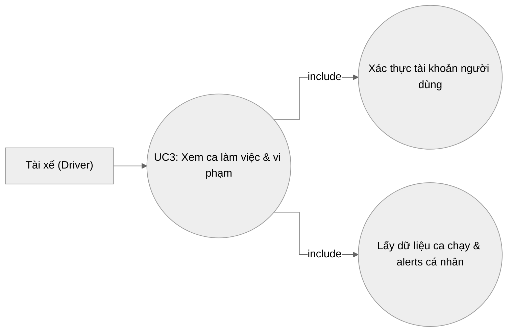

#### 3.2. Bảng đặc tả chi tiết
| Mục tiêu | Mô tả chi tiết |
| :--- | :--- |
| **Tên Use Case** | UC3: Xem ca làm việc & vi phạm cá nhân |
| **Tác nhân (Actors)** | Tài xế (Driver) |
| **Mục đích** | Cho phép tài xế theo dõi lịch trình lái xe, tổng giờ làm việc thực tế và kiểm tra nhanh các ngày có phát sinh vi phạm cảnh báo từ AI. |
| **Tiền điều kiện** | Tài xế đã đăng nhập vào Driver Portal thông qua tài khoản cá nhân. |
| **Luồng xử lý chính** | 1. Tài xế truy cập vào mục "Timekeeping & History" trên giao diện Portal. 2. Frontend tự động gọi API GET `/api/v1/sessions` kèm token định danh. 3. Server truy vấn và chỉ trả về các ca chạy thuộc về tài khoản của tài xế đang đăng nhập. 4. Giao diện hiển thị lịch tháng trực quan: Các ngày làm việc hiển thị tổng giờ lái (ví dụ: `8.0h`). Ngày nào có vi phạm sẽ xuất hiện icon cảnh báo màu đỏ nhấp nháy. 5. Tài xế click vào ngày cụ thể hoặc ca chạy trong danh sách để xem chi tiết timeline các vi phạm (ngủ gật, mất tập trung) xảy ra trong ca đó. |
| **Hậu điều kiện** | Tài xế nắm được lịch trình và mức độ vi phạm an toàn của bản thân để tự điều chỉnh hành vi lái xe. |

---

### 4. UC4: Gửi Đơn Kháng Nghị Vi Phạm (Submit Violation Appeal)

#### 4.1. Sơ đồ Use Case phân rã
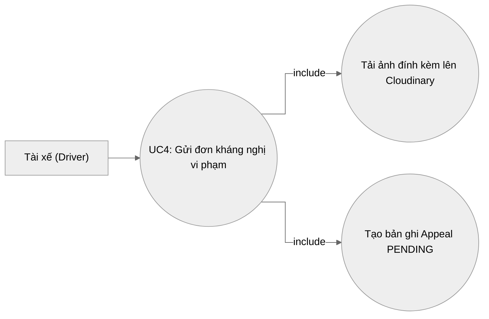

#### 4.2. Bảng đặc tả chi tiết
| Mục tiêu | Mô tả chi tiết |
| :--- | :--- |
| **Tên Use Case** | UC4: Gửi đơn kháng nghị vi phạm |
| **Tác nhân (Actors)** | Tài xế (Driver) |
| **Mục đích** | Tạo cơ chế công bằng, cho phép tài xế khiếu nại đối với các sự cố bị AI nhận diện sai bằng cách giải trình và gửi bằng chứng bác bỏ. |
| **Tiền điều kiện** | Sự cố vi phạm (Alert) đang ở trạng thái chưa bị kháng nghị, thuộc quyền sở hữu của tài xế. |
| **Luồng xử lý chính** | 1. Tài xế vào mục "Violations Feed", chọn sự cố muốn kháng nghị (ví dụ: bị phạt lỗi Ngủ gật do dụi mắt). 2. Tài xế xem video/hình ảnh bằng chứng của hệ thống và nhấn nút "Submit Appeal". 3. Tài xế nhập giải trình lý do (ví dụ: "Tôi bị bụi bay vào mắt nên dụi mắt, không phải buồn ngủ"). 4. Tài xế tải lên hình ảnh minh chứng đính kèm (nếu có). 5. Frontend đẩy tệp ảnh lên Cloud Storage và nhận về URL ảnh. 6. Frontend gửi POST request chứa lý do và URL ảnh đính kèm lên API Server. 7. Server lưu thông tin kháng nghị mới ở trạng thái `PENDING` và cập nhật thông báo tới quản trị viên. |
| **Hậu điều kiện** | Đơn kháng nghị được tạo thành công với trạng thái `PENDING`. |

---

### 5. UC5: Giám Sát LiveMonitor Trực Tuyến (Real-Time Driver Monitoring)

#### 5.1. Sơ đồ Use Case phân rã
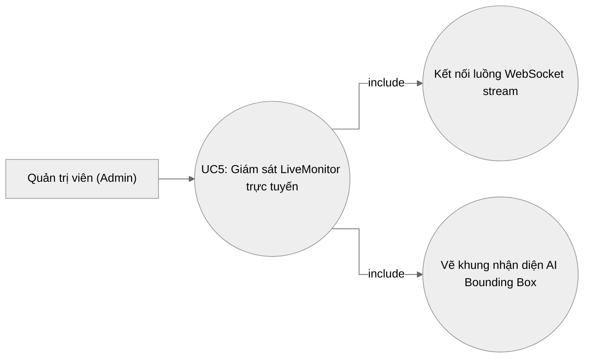

#### 5.2. Bảng đặc tả chi tiết
| Mục tiêu | Mô tả chi tiết |
| :--- | :--- |
| **Tên Use Case** | UC5: Giám sát LiveMonitor trực tuyến |
| **Tác nhân (Actors)** | Quản trị viên (Admin) |
| **Mục đích** | Giúp quản trị viên theo dõi trực tiếp hình ảnh trong cabin xe, trạng thái tỉnh táo của tài xế và nhận telemetry thời gian thực từ thiết bị trên xe. |
| **Tiền điều kiện** | Admin đã đăng nhập vào hệ thống và có xe/tài xế đang trong ca làm việc `ACTIVE`. |
| **Luồng xử lý chính** | 1. Admin truy cập màn hình "LiveMonitor" từ Sidebar quản trị. 2. Hệ thống hiển thị danh sách các tài xế đang hoạt động. 3. Admin chọn một tài xế. Frontend thiết lập kết nối WebSocket tới server. 4. Server bắt đầu chuyển tiếp luồng ảnh (JPEG frames) từ camera cabin của xe đó lên web. 5. Frontend vẽ các khung nhận diện (mắt nhắm/mở, miệng há, điện thoại) đè lên luồng video. 6. Màn hình đồng thời hiển thị log telemetry thời gian thực (trạng thái còi báo, lịch sử quét vân tay gần nhất). |
| **Hậu điều kiện** | Luồng video và dữ liệu telemetry được truyền tải mượt mà với độ trễ thấp (<100ms). |

---

### 6. UC6: Phê Duyệt Đơn Kháng Nghị (Approve/Reject Violation Appeal)

#### 6.1. Sơ đồ Use Case phân rã
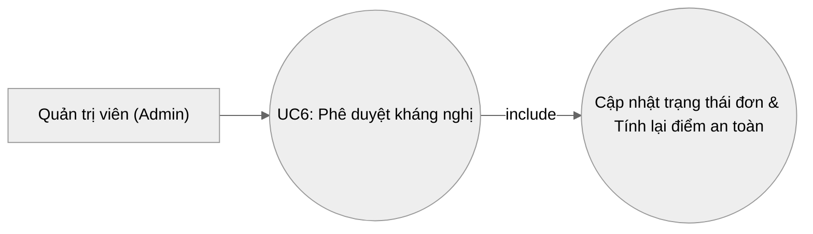

#### 6.2. Bảng đặc tả chi tiết
| Mục tiêu | Mô tả chi tiết |
| :--- | :--- |
| **Tên Use Case** | UC6: Phê duyệt kháng nghị |
| **Tác nhân (Actors)** | Quản trị viên (Admin) |
| **Mục đích** | Cho phép người quản lý phê duyệt hoặc từ chối kháng nghị của tài xế sau khi xem xét kỹ bằng chứng hệ thống và giải trình thực tế. |
| **Tiền điều kiện** | Tồn tại đơn kháng nghị ở trạng thái `PENDING`. |
| **Luồng xử lý chính** | 1. Admin truy cập mục "Appeals Management". 2. Chọn đơn kháng nghị cần duyệt. Xem lại ảnh vi phạm gốc và lý do giải trình của tài xế. 3. Admin nhập phản hồi chính thức (admin note). 4. Admin bấm nút "Chấp nhận" (Approve) hoặc "Từ chối" (Reject). 5. Server cập nhật trạng thái đơn tương ứng thành `APPROVED` hoặc `REJECTED`. 6. **Nếu Chấp nhận**: Server tự động thu hồi lỗi vi phạm đó (vô hiệu hóa alert), tính toán và khôi phục lại điểm số an toàn (Safety Score) cho tài xế. 7. Giao diện cập nhật tức thì trạng thái của đơn và gửi thông báo kết quả tới Driver Portal. |
| **Hậu điều kiện** | Đơn kháng nghị chuyển trạng thái hoàn tất. Điểm an toàn tài xế được điều chỉnh tự động nếu kháng nghị thành công. |

---

### 7. UC7: Đăng Ký Vân Tay Cho Tài Xế (Enroll Fingerprint Command)

#### 7.1. Sơ đồ Use Case phân rã
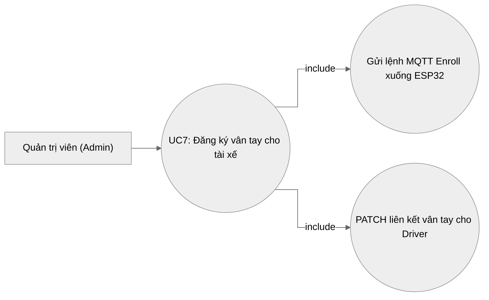

#### 7.2. Bảng đặc tả chi tiết
| Mục tiêu | Mô tả chi tiết |
| :--- | :--- |
| **Tên Use Case** | UC7: Đăng ký vân tay cho tài xế |
| **Tác nhân (Actors)** | Quản trị viên (Admin), Tài xế, Thiết bị ESP32 |
| **Mục đích** | Liên kết một ngón tay vật lý của tài xế với tài khoản của họ trên cơ sở dữ liệu thông qua cảm biến nhúng. |
| **Tiền điều kiện** | Tài xế đã có tài khoản trên hệ thống nhưng chưa gán vân tay. Thiết bị ESP32 đang trực tuyến (online). |
| **Luồng xử lý chính** | 1. Admin vào trang "Drivers Management", chọn tài xế và ấn nút "Enroll Fingerprint". 2. Server nhận yêu cầu, publish tin nhắn chứa `user_id` xuống MQTT topic `roadsentinel/commands/enroll`. 3. ESP32 nhận lệnh qua MQTT, chuyển sang chế độ Enroll, bật đèn LED sáng liên tục. 4. Tài xế đặt ngón tay lên cảm biến 2 lần để máy quét học đặc trưng vân tay. 5. Thiết bị tạo model, lưu vào bộ nhớ flash với ID trống tiếp theo (ví dụ: ID = 5). 6. ESP32 thực hiện gọi API PATCH để lưu chuỗi `FINGER_5` vào thuộc tính vân tay của user đó trên server. 7. Server phản hồi thành công. ESP32 gửi thông báo kết quả về MQTT để hiển thị trên web Admin. |
| **Hậu điều kiện** | Bản ghi tài xế được cập nhật mã vân tay tương ứng. Thiết bị tự động thoát chế độ Enroll và quay lại chế độ quét hoạt động bình thường. |

---

### 8. UC8: Quản Lý Thiết Bị Và Xe (Manage Vehicles & Devices)

#### 8.1. Sơ đồ Use Case phân rã
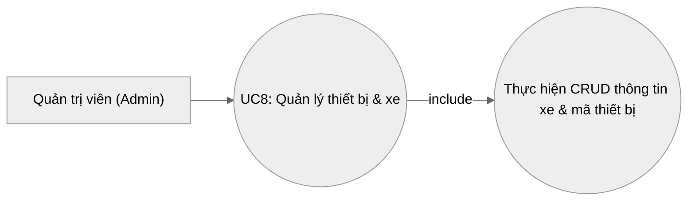

#### 8.2. Bảng đặc tả chi tiết
| Mục tiêu | Mô tả chi tiết |
| :--- | :--- |
| **Tên Use Case** | UC8: Quản lý thiết bị và xe |
| **Tác nhân (Actors)** | Quản trị viên (Admin) |
| **Mục đích** | Thiết lập thông tin xe và cấu hình liên kết mã định danh phần cứng (Device ID) để hệ thống nhận diện đúng xe phát tín hiệu. |
| **Tiền điều kiện** | Admin đăng nhập quyền quản trị. |
| **Luồng xử lý chính** | 1. Admin truy cập màn hình "Vehicles Management". 2. Hệ thống hiển thị danh sách xe, biển số, dòng xe, trạng thái hoạt động và Device ID liên kết. 3. Admin có thể thêm xe mới, sửa biển số xe hoặc gán mã thiết bị nhúng (ví dụ: gán `device_id = "DEV-001"` cho xe biển số `43A-12345`). 4. Server lưu thông tin cập nhật vào Database PostgreSQL. 5. Mọi gói tin truyền tải từ thiết bị nhúng mang mã `DEV-001` từ nay sẽ tự động được ánh xạ với xe `43A-12345`. |
| **Hậu điều kiện** | Cấu hình liên kết xe-thiết bị được cập nhật, phục vụ phân tích dữ liệu và gửi thông báo MQTT chính xác. |

---

### 9. UC9: Truyền Luồng Video Cabin (Stream Cabin Video)

#### 9.1. Sơ đồ Use Case phân rã
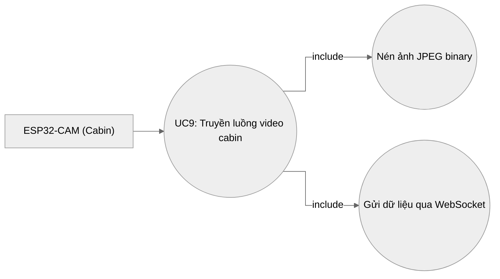

#### 9.2. Bảng đặc tả chi tiết
| Mục tiêu | Mô tả chi tiết |
| :--- | :--- |
| **Tên Use Case** | UC9: Truyền luồng video cabin |
| **Tác nhân (Actors)** | Thiết bị nhúng ESP32-CAM |
| **Mục đích** | Chụp hình ảnh thực tế từ vị trí lái xe liên tục để cung cấp đầu vào cho hệ thống phân tích AI. |
| **Tiền điều kiện** | Thiết bị nhúng được cấp nguồn ổn định trên xe và đã kết nối mạng internet/WiFi cabin. |
| **Luồng xử lý chính** | 1. ESP32-CAM khởi tạo, thiết lập kết nối WebSocket client tới máy chủ Gateway `/ws/stream/cam`. 2. Bộ xử lý ESP32 điều khiển cảm biến camera OV2640 chụp ảnh ở độ phân giải SVGA/VGA. 3. Ảnh được nén dạng JPEG nhị phân (Binary) trực tiếp trên chip để giảm dung lượng mạng. 4. Thiết bị đẩy gói tin nhị phân qua WebSocket với tốc độ từ 15-20 khung hình/giây. 5. Server nhận gói tin nhị phân, giải nén và chuyển tiếp cho AI Engine xử lý tức thì. |
| **Hậu điều kiện** | Luồng hình ảnh được đẩy lên server liên tục và ổn định. |

---

### 10. UC10: Kích Hoạt Còi Cảnh Báo Vật Lý Trên Xe (Trigger Physical Alarm Buzzer)

#### 10.1. Sơ đồ Use Case phân rã
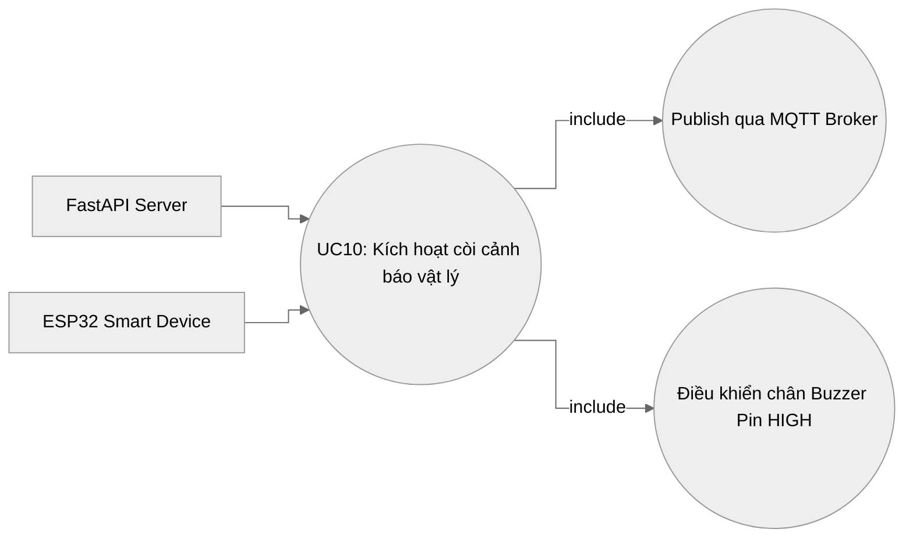

#### 10.2. Bảng đặc tả chi tiết
| Mục tiêu | Mô tả chi tiết |
| :--- | :--- |
| **Tên Use Case** | UC10: Kích hoạt còi cảnh báo vật lý trên xe |
| **Tác nhân (Actors)** | FastAPI Server, Thiết bị nhúng ESP32, MQTT Broker |
| **Mục đích** | Tác động vật lý (âm thanh) trực tiếp lên tài xế khi họ vi phạm lỗi nguy hiểm (ngủ gật, dùng điện thoại) để ngăn chặn tai nạn xảy ra. |
| **Tiền điều kiện** | AI Engine xác nhận hành vi vi phạm nghiêm trọng kéo dài vượt quá ngưỡng cửa sổ trượt. ESP32 trên cabin xe đang kết nối MQTT Broker. |
| **Luồng xử lý chính** | 1. AI Engine kích hoạt sự cố vi phạm nghiêm trọng (ví dụ: `SLEEPING`). 2. Server gửi bản tin JSON chứa mã cảnh báo qua giao thức MQTT lên chủ đề `roadsentinel/alerts/{vehicle_id}`. 3. MQTT Broker chuyển tiếp tin nhắn tới ESP32 đang subscribe trên xe. 4. ESP32 giải mã gói tin JSON, kiểm tra trường `event`. Nếu phát hiện các mã lỗi ngủ gật/buồn ngủ/dùng điện thoại, thiết bị nhấp nháy đèn LED đỏ và kích hoạt chân GPIO điều khiển còi báo Buzzer kêu bíp ngắt quãng liên tục. 5. Còi tự động ngắt khi nhận được bản tin có trường `event = "normal"` từ server (tài xế đã tỉnh táo lại) hoặc tự tắt sau 3 phút bảo vệ phần cứng. |
| **Hậu điều kiện** | Còi báo động vật lý trên xe kêu đúng thời điểm, đảm bảo cảnh tỉnh lái xe tức thì. |
